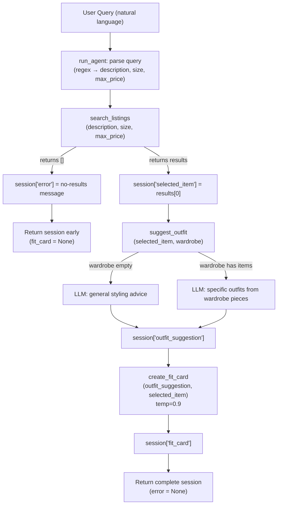

# FitFindr — planning.md

> Complete this document before writing any implementation code.
> Your spec and agent diagram are what you'll use to direct AI tools (Claude, Copilot, etc.) to generate your implementation — the more specific they are, the more useful the generated code will be.
> Your planning.md will be reviewed as part of your submission.
> Update it before starting any stretch features.

---

## Tools

List every tool your agent will use. For each tool, fill in all four fields.
You must have at least 3 tools. The three required tools are listed — add any additional tools below them.

### Tool 1: search_listings

**What it does:**
Loads all listings from `data/listings.json`, filters them by size (case-insensitive substring match) and max_price (inclusive), scores each remaining listing by counting how many tokens from `description` appear in the listing's title, description text, style_tags, category, and colors, drops listings with a score of 0, and returns the survivors sorted by score descending.

**Input parameters:**
- `description` (str): Keywords describing what the user wants, e.g. `"vintage graphic tee"`. Tokenized into lowercase words for scoring.
- `size` (str | None): Size string to filter by, e.g. `"M"` or `"S/M"`. Matching is case-insensitive. If `None`, size filtering is skipped entirely.
- `max_price` (float | None): Maximum price the user will pay, inclusive. Listings with `price > max_price` are dropped before scoring. If `None`, price filtering is skipped.

**What it returns:**
A `list[dict]` — each dict is a full listing record from `listings.json` containing: `id` (str), `title` (str), `description` (str), `category` (str — one of tops/bottoms/outerwear/shoes/accessories), `style_tags` (list[str]), `size` (str), `condition` (str — excellent/good/fair), `price` (float), `colors` (list[str]), `brand` (str or None), `platform` (str — depop/thredUp/poshmark). Sorted by relevance score, highest first. Returns `[]` on no match — never raises.

**What happens if it fails or returns nothing:**
The agent checks `len(session["search_results"]) == 0` immediately after the call. If empty, it sets `session["error"]` to `f"No listings found matching '{query}'. Try different keywords, a different size, or a higher price limit."` and returns the session immediately — `suggest_outfit` and `create_fit_card` are never called.

---

### Tool 2: suggest_outfit

**What it does:**
Calls the Groq LLM to produce 1–2 outfit suggestions for a thrifted item. If the wardrobe is empty, it asks for general styling advice. If the wardrobe has items, it asks the LLM to build specific outfits by pairing the new item with named pieces from the wardrobe.

**Input parameters:**
- `new_item` (dict): A listing dict returned by `search_listings` — the item the user is considering buying. Used for title, description, style_tags, colors, price, and platform in the prompt.
- `wardrobe` (dict): A wardrobe dict with an `'items'` key containing a list of wardrobe item dicts, each with `id`, `name`, `category`, `colors`, `style_tags`, and optional `notes`. May be `{"items": []}` — the empty case is handled explicitly.

**What it returns:**
A non-empty `str` with outfit suggestions. For a non-empty wardrobe, the response names specific wardrobe pieces (by name) in each outfit. For an empty wardrobe, it describes what kinds of items pair well with the new piece and what aesthetic it suits.

**What happens if it fails or returns nothing:**
If `wardrobe["items"]` is empty, the tool switches to a general-styling prompt rather than raising. If the LLM call raises an exception, the tool catches it and returns `f"Unable to generate outfit suggestion. The {new_item['title']} would pair well with jeans and a neutral top."` so the agent can still produce a fit card.

---

### Tool 3: create_fit_card

**What it does:**
Calls the Groq LLM at a higher temperature (0.9) to write a 2–4 sentence Instagram/TikTok caption for the thrifted find and outfit. The caption should sound like a real OOTD post: casual, specific about vibe, and mentioning item name, price, and platform exactly once each.

**Input parameters:**
- `outfit` (str): The outfit suggestion string returned by `suggest_outfit`. If empty or whitespace-only, the function returns an error message string without calling the LLM.
- `new_item` (dict): The listing dict for the thrifted item, used to supply `title`, `price`, and `platform` to the prompt.

**What it returns:**
A `str` containing a 2–4 sentence caption. Because temperature is 0.9, the output varies for different inputs. If `outfit` is empty or whitespace-only, returns the string `"Unable to generate fit card: no outfit suggestion was provided."` — never raises.

**What happens if it fails or returns nothing:**
If `outfit` is empty/whitespace, the function returns the descriptive error string above without calling the LLM. If the LLM call raises, the function catches the exception and returns `f"Fit card unavailable. Found: {new_item['title']} — ${new_item['price']} on {new_item['platform']}."`.

---

### Additional Tools (if any)

No additional tools are required for the core (Milestones 1–6) implementation.

---

## Planning Loop

**How does your agent decide which tool to call next?**

The loop is a fixed linear sequence with one conditional early-exit. Here is the exact decision logic:

1. **Parse** — Always runs first. Extract `description`, `size`, and `max_price` from the raw query using regex:
   - price: match `r'(?:under|below|less than|up to|max)\s*\$?(\d+(?:\.\d+)?)'` → parse as float
   - size: match `r'\bsize\s+([A-Z0-9/]+)'` (case-insensitive) → extract token; also check standalone tokens like `"M"`, `"XL"`, `"S/M"` with `r'\b(XXS|XS|S/M|S|M|L|XL|XXL)\b'`
   - description: the original query with matched price and size clauses stripped, then lowercased and whitespace-normalized
   - Store results in `session["parsed"]`.

2. **Call `search_listings`** — Always runs after parsing. Pass `session["parsed"]["description"]`, `session["parsed"]["size"]`, and `session["parsed"]["max_price"]`.
   - **Condition**: If `session["search_results"]` is empty → set `session["error"]` to a user-facing message, return session immediately. The remaining tools are skipped entirely.
   - If results exist → store `session["search_results"]`, set `session["selected_item"] = session["search_results"][0]`, continue.

3. **Call `suggest_outfit`** — Only reached if step 2 found results. Pass `session["selected_item"]` and `session["wardrobe"]`.
   - Store result in `session["outfit_suggestion"]`.

4. **Call `create_fit_card`** — Only reached after step 3. Pass `session["outfit_suggestion"]` and `session["selected_item"]`.
   - Store result in `session["fit_card"]`.

5. **Return session** — The loop is complete. `session["error"]` is `None`.

The agent knows it is done when `create_fit_card` returns (happy path) or when `search_listings` returns an empty list (early exit). There is no retry or backtracking in the base implementation.

---

## State Management

**How does information from one tool get passed to the next?**

All state lives in a single `session` dict initialized by `_new_session()`. No global variables or class state are used. Here is what is stored and when:

| Key | Set by | Used by |
|-----|--------|---------|
| `session["query"]` | `_new_session()` at start | Error messages; query parsing |
| `session["parsed"]` | Regex parsing in `run_agent` | `search_listings` call |
| `session["search_results"]` | `search_listings` return value | Selecting `selected_item` |
| `session["selected_item"]` | `session["search_results"][0]` | `suggest_outfit`, `create_fit_card` |
| `session["wardrobe"]` | Passed in by caller, stored in `_new_session()` | `suggest_outfit` |
| `session["outfit_suggestion"]` | `suggest_outfit` return value | `create_fit_card` |
| `session["fit_card"]` | `create_fit_card` return value | Returned to caller / displayed in UI |
| `session["error"]` | Set on empty search results or caught exceptions | Checked by `app.py` before rendering |

The user never re-enters any intermediate value. The item found in step 2 is automatically passed into steps 3 and 4 by reading `session["selected_item"]`. The outfit from step 3 is passed into step 4 by reading `session["outfit_suggestion"]`.

---

## Error Handling

For each tool, describe the specific failure mode you're handling and what the agent does in response.

| Tool | Failure mode | Agent response |
|------|-------------|----------------|
| search_listings | Returns an empty list because no listings match the description, size, and price filters | Sets `session["error"]` to `"No listings found matching '{query}'. Try different keywords, a different size, or a higher price limit."` and returns the session immediately without calling `suggest_outfit` or `create_fit_card`. The UI displays this message in the first panel. |
| suggest_outfit | `wardrobe["items"]` is an empty list (new user has no saved clothes) | Switches to a general-styling prompt asking the LLM what types of pieces pair well with the new item and what aesthetic it fits, rather than attempting to reference specific wardrobe pieces. Returns a non-empty string. |
| create_fit_card | `outfit` argument is an empty string or whitespace-only (e.g., if `suggest_outfit` returned `""`) | Returns the string `"Unable to generate fit card: no outfit suggestion was provided."` without calling the LLM. No exception is raised; the agent can still surface the listing and the empty outfit result to the user. |

---

## Architecture

All state flows through the `session` dict (shown as a single object traveling top to bottom). The only branching is after `search_listings` (empty vs. non-empty results) and inside `suggest_outfit` (empty vs. non-empty wardrobe). All other steps are unconditional once the previous step succeeds.

---

## AI Tool Plan

**Milestone 3 — Individual tool implementations:**

**Tool 1 (`search_listings`):** Provide Claude with the Tool 1 spec from this file (inputs with types, return value description, failure mode) plus the `load_listings()` docstring from `utils/data_loader.py`. Ask it to implement `search_listings()` using token-overlap scoring across title, description, style_tags, category, and colors fields. Verify by running three test cases directly in `tools.py __main__`: `search_listings("vintage graphic tee", None, 30.0)` should return 3–4 results with lst_002/lst_006/lst_033 near the top; `search_listings("track jacket", "M", None)` should return lst_004; `search_listings("designer ballgown", "XXS", 5.0)` should return `[]`.

**Tool 2 (`suggest_outfit`):** Provide Claude with the Tool 2 spec (both the empty and non-empty wardrobe paths), the wardrobe schema from `data/wardrobe_schema.json`, and the Groq client pattern from `_get_groq_client()`. Ask it to implement both prompt branches with `model="llama-3.3-70b-versatile"` and `temperature=0.7`. Verify by calling with `get_example_wardrobe()` (should reference specific wardrobe items by name) and `get_empty_wardrobe()` (should still return a non-empty styling suggestion).

**Tool 3 (`create_fit_card`):** Provide Claude with the Tool 3 spec (guard condition, prompt style guidelines, `temperature=0.9`). Ask it to implement the empty-outfit guard and the LLM call. Verify by: (1) calling with an empty string for `outfit` → should return the error string without an API call; (2) calling twice with the same valid inputs → outputs should differ due to high temperature; (3) checking the returned string mentions the item's title, price, and platform exactly once.

**Milestone 4 — Planning loop and state management:**

Provide Claude with the Planning Loop section, the State Management table, and the Architecture diagram from this file, plus the `_new_session()` function and its docstring from `agent.py`. Ask it to implement `run_agent()` with the five-step sequence and the early-exit condition after `search_listings`. Verify by running `python agent.py` directly — the `__main__` block exercises both the happy path (`"vintage graphic tee under $30"`) and the no-results path (`"designer ballgown size XXS under $5"`). The happy path should print a real listing title, outfit, and fit card; the no-results path should print only the error message.

---

## A Complete Interaction (Step by Step)

FitFindr accepts a natural language shopping query, parses it into structured parameters (description, size, max_price), and passes those parameters through three tools in sequence: `search_listings` finds matching secondhand items, `suggest_outfit` uses the top result and the user's wardrobe to propose specific outfit combinations, and `create_fit_card` turns that suggestion into a shareable caption. Each tool is triggered only when the previous step succeeds — if `search_listings` returns nothing, the agent tells the user exactly what to adjust and stops, never calling `suggest_outfit` or `create_fit_card` with empty input.

Write out what a full user interaction looks like from start to finish — tool call by tool call. Use a specific example query.

**Example user query:** "I'm looking for a vintage graphic tee under $30. I mostly wear baggy jeans and chunky sneakers. What's out there and how would I style it?"

**Step 1:**
The agent runs the regex parser on the query. It extracts `max_price = 30.0` from "under $30". No size token is found, so `size = None`. The remainder — "vintage graphic tee" — becomes `description` after stripping the price clause and filler phrases. These values are stored in `session["parsed"]`.

**Step 2:**
The agent calls `search_listings("vintage graphic tee", size=None, max_price=30.0)`. The function loads all 40 listings, drops the 14 priced above $30, then scores the remaining 26 by counting how many of the tokens `{"vintage", "graphic", "tee"}` appear across each listing's text fields. Listings `lst_002` (Y2K Baby Tee, $18, style_tags include "vintage" and "graphic tee"), `lst_006` (Graphic Tee 2003, $24, "graphic tee" + "vintage" in tags), and `lst_033` (Vintage Band Tee, $19, "vintage" + "graphic tee" in tags) each score 3 and rank at the top. `session["search_results"]` is set to the sorted list, and `session["selected_item"]` is set to `lst_002` — it ties on score with lst_006 and lst_033, but Python's stable sort preserves original dataset order, so lst_002 (index 1 in listings.json) ranks first.

**Step 3:**
The agent calls `suggest_outfit(new_item=lst_002, wardrobe=example_wardrobe)`. The wardrobe has 10 items, so the non-empty path runs. The LLM receives a prompt listing the Y2K butterfly baby tee's details alongside the user's wardrobe (baggy dark-wash jeans w_001, chunky platform sneakers w_007, white ribbed tank w_003, etc.) and is asked for 1–2 specific outfit combinations. It returns something like: "Outfit 1: Tuck the butterfly baby tee into your baggy dark-wash jeans and finish with the chunky platform sneakers for a Y2K streetwear moment. Outfit 2: Layer the baby tee over your white ribbed tank, pair with the wide-leg khaki trousers, and add the leather crossbody for an elevated take on the Y2K aesthetic." This string is stored in `session["outfit_suggestion"]`.

**Step 4:**
The agent calls `create_fit_card(outfit=session["outfit_suggestion"], new_item=lst_002)`. The `outfit` string is non-empty, so the guard passes. The LLM receives a prompt with the outfit description and is asked for a 2–4 sentence casual OOTD caption mentioning "Y2K Baby Tee", "$18", and "depop" once each at temperature 0.9. It returns something like: "found my new fave top on depop for $18 and i literally cannot stop wearing it 🦋 the Y2K Baby Tee tucked into my baggies with platform sneakers is giving everything i wanted this era to be. the butterfly print is so specific it goes with literally nothing and somehow everything at the same time." This is stored in `session["fit_card"]`.

**Final output to user:**
The Gradio UI displays three panels: (1) **Top listing found** — formatted text with the Y2K Baby Tee's title, price ($18.00), platform (depop), size (S/M), and condition (excellent); (2) **Outfit idea** — the full outfit suggestion string from step 3; (3) **Your fit card** — the OOTD caption from step 4.
