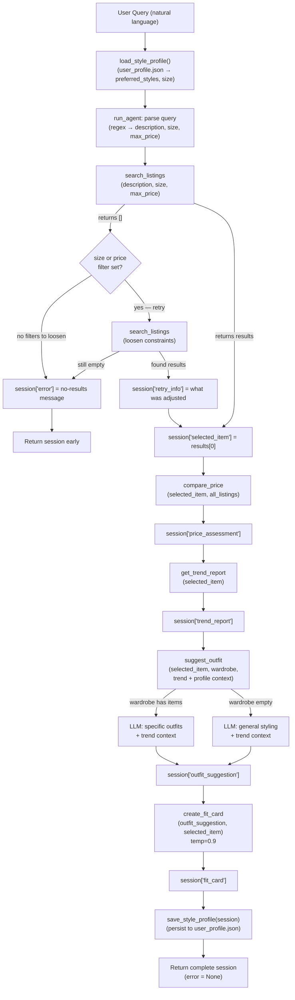

# FitFindr — planning.md

> Complete this document before writing any implementation code.
> Your spec and agent diagram are what you'll use to direct AI tools (Claude, Copilot, etc.) to generate your implementation — the more specific they are, the more useful the generated code will be.
> Your planning.md will be reviewed as part of your submission.
> Update it before starting any stretch features.

---

## Tools

List every tool your agent will use. For each tool, fill in all four fields.
You must have at least 3 tools. The three required tools are listed — add any additional tools below them.

### Tool 1: search_listings

**What it does:**
Loads all listings from `data/listings.json`, filters them by size (case-insensitive substring match) and max_price (inclusive), scores each remaining listing by counting how many tokens from `description` appear in the listing's title, description text, style_tags, category, and colors, drops listings with a score of 0, and returns the survivors sorted by score descending.

**Input parameters:**
- `description` (str): Keywords describing what the user wants, e.g. `"vintage graphic tee"`. Tokenized into lowercase words for scoring.
- `size` (str | None): Size string to filter by, e.g. `"M"` or `"S/M"`. Matching is case-insensitive. If `None`, size filtering is skipped entirely.
- `max_price` (float | None): Maximum price the user will pay, inclusive. Listings with `price > max_price` are dropped before scoring. If `None`, price filtering is skipped.

**What it returns:**
A `list[dict]` — each dict is a full listing record from `listings.json` containing: `id` (str), `title` (str), `description` (str), `category` (str — one of tops/bottoms/outerwear/shoes/accessories), `style_tags` (list[str]), `size` (str), `condition` (str — excellent/good/fair), `price` (float), `colors` (list[str]), `brand` (str or None), `platform` (str — depop/thredUp/poshmark). Sorted by relevance score, highest first. Returns `[]` on no match — never raises.

**What happens if it fails or returns nothing:**
The agent checks `len(session["search_results"]) == 0` immediately after the call. If empty, it sets `session["error"]` to `f"No listings found matching '{query}'. Try different keywords, a different size, or a higher price limit."` and returns the session immediately — `suggest_outfit` and `create_fit_card` are never called.

---

### Tool 2: suggest_outfit

**What it does:**
Calls the Groq LLM to produce 1–2 outfit suggestions for a thrifted item. If the wardrobe is empty, it asks for general styling advice. If the wardrobe has items, it asks the LLM to build specific outfits by pairing the new item with named pieces from the wardrobe.

**Input parameters:**
- `new_item` (dict): A listing dict returned by `search_listings` — the item the user is considering buying. Used for title, description, style_tags, colors, price, and platform in the prompt.
- `wardrobe` (dict): A wardrobe dict with an `'items'` key containing a list of wardrobe item dicts, each with `id`, `name`, `category`, `colors`, `style_tags`, and optional `notes`. May be `{"items": []}` — the empty case is handled explicitly.

**What it returns:**
A non-empty `str` with outfit suggestions. For a non-empty wardrobe, the response names specific wardrobe pieces (by name) in each outfit. For an empty wardrobe, it describes what kinds of items pair well with the new piece and what aesthetic it suits.

**What happens if it fails or returns nothing:**
If `wardrobe["items"]` is empty, the tool switches to a general-styling prompt rather than raising. If the LLM call raises an exception, the tool catches it and returns `f"Unable to generate outfit suggestion. The {new_item['title']} would pair well with jeans and a neutral top."` so the agent can still produce a fit card.

---

### Tool 3: create_fit_card

**What it does:**
Calls the Groq LLM at a higher temperature (0.9) to write a 2–4 sentence Instagram/TikTok caption for the thrifted find and outfit. The caption should sound like a real OOTD post: casual, specific about vibe, and mentioning item name, price, and platform exactly once each.

**Input parameters:**
- `outfit` (str): The outfit suggestion string returned by `suggest_outfit`. If empty or whitespace-only, the function returns an error message string without calling the LLM.
- `new_item` (dict): The listing dict for the thrifted item, used to supply `title`, `price`, and `platform` to the prompt.

**What it returns:**
A `str` containing a 2–4 sentence caption. Because temperature is 0.9, the output varies for different inputs. If `outfit` is empty or whitespace-only, returns the string `"Unable to generate fit card: no outfit suggestion was provided."` — never raises.

**What happens if it fails or returns nothing:**
If `outfit` is empty/whitespace, the function returns the descriptive error string above without calling the LLM. If the LLM call raises, the function catches the exception and returns `f"Fit card unavailable. Found: {new_item['title']} — ${new_item['price']} on {new_item['platform']}."`.

---

### Additional Tools (if any)

### Tool 4: compare_price

**What it does:**
Finds listings in the dataset with the same category and at least one overlapping style tag as the target item, computes the price distribution of those comparables (avg, median, min, max), and returns a plain-English verdict (great deal / fair price / above average) with the numbers used to reach it.

**Input parameters:**
- `item` (dict): The selected listing dict — uses `id`, `category`, `style_tags`, and `price`.
- `listings` (list[dict]): The full dataset (returned by `load_listings()`), used to find comparables. The item itself is excluded from the comparable set.

**What it returns:**
A `str` with three lines: the price and verdict, the comparable set stats, and one sentence of reasoning. Example: `"Price: $18.00 — GREAT DEAL\nComparable tops (7 listings): avg $23.14, range $15.00–$35.00\nReasoning: Y2K Baby Tee is priced below the $23.14 average for tops with similar style tags."` Returns `"Not enough comparable listings to assess pricing for {title}."` if fewer than 2 comparables are found.

**What happens if it fails or returns nothing:**
If fewer than 2 comparables exist, returns the informative string above — never raises. The agent still proceeds to `get_trend_report` and `suggest_outfit`.

---

### Tool 5: get_trend_report

**What it does:**
Loads trend data from `data/trends.json` (aggregated from Depop trending searches and Pinterest fashion boards, updated seasonally), cross-references the item's style tags, category, and colors against the current trending aesthetics and categories, and uses the Groq LLM to produce a 2–3 sentence trend assessment.

**Input parameters:**
- `item` (dict): The selected listing dict — uses `title`, `category`, `style_tags`, and `colors`.

**What it returns:**
A `str` with a trend assessment: whether the item is on-trend, which current aesthetics it aligns with, and how that context should influence how it's styled. This string is passed into `suggest_outfit` as trend context so the outfit recommendations reflect the current fashion moment. Returns `"Trend data unavailable — styling without trend context."` if the trends file is missing or the LLM call fails.

**What happens if it fails or returns nothing:**
If `data/trends.json` is missing or unreadable, returns the fallback string above. If the LLM call raises, catches the exception and returns the same fallback. The agent continues normally — trend context becomes `None` in the `suggest_outfit` prompt.

---

### Style Profile Memory (save/load functions, not a standalone tool)

**What it does:**
`load_style_profile()` reads `user_profile.json` from the project root (or returns an empty profile if the file doesn't exist). `save_style_profile(session)` extracts the selected item's style tags, the parsed size, and the description from the completed session and merges them into the profile, keeping up to 15 unique style tags (most recent first) and the most recently used size.

**Input parameters (save_style_profile):**
- `session` (dict): The completed session dict — reads `selected_item`, `parsed["size"]`, and `parsed["description"]`.

**What it returns:**
`load_style_profile()` returns a `dict` with keys `preferred_styles` (list[str]), `preferred_size` (str | None), and `search_history` (list[str], last 5). `save_style_profile` returns `None` — side effect only.

**What happens if it fails or returns nothing:**
If `user_profile.json` is missing or contains malformed JSON, `load_style_profile()` catches the exception and returns an empty profile. `save_style_profile` catches write errors silently — a failed save doesn't abort the session.

---

### Retry Logic (planning loop modification, not a separate function)

**What it does:**
If `search_listings` returns an empty list and a size filter was applied, the agent retries automatically without the size filter and records what was loosened in `session["retry_info"]`. If still empty and a price filter was applied, retries with both filters removed. Informs the user of what was adjusted in the output.

**What happens if all retries fail:**
Sets `session["error"]` as before and returns early.

---

## Planning Loop

**How does your agent decide which tool to call next?**

The loop is a linear sequence with one conditional early-exit and retry logic. Here is the exact decision logic:

1. **Load style profile** — `load_style_profile()` reads `user_profile.json`. If the file exists, `preferred_styles` and `preferred_size` are available as context for later steps. If not, an empty profile is used.

2. **Parse** — Extract `description`, `size`, and `max_price` from the raw query using regex:
   - price: match `r'(?:under|below|less than|up to|max)\s*\$?(\d+(?:\.\d+)?)'` → parse as float
   - size: match `r'\bsize\s+([A-Z0-9/]+)'` first; fallback to `r'\b(XXS|XS|S/M|M/L|L/XL|S|M|L|XL|XXL|XXXL)\b'`
   - description: the original query with price and size clauses stripped, lowercased, whitespace-normalized
   - Store results in `session["parsed"]`.

3. **Call `search_listings` with retry** — Always runs after parsing.
   - **First attempt**: use all three parsed parameters.
   - **Condition 1**: If results are empty AND `size` was set → retry with `size=None`, store `session["retry_info"] = "No results for size '{size}'. Showing results without size filter."` If retry finds results, continue to step 4.
   - **Condition 2**: If still empty AND `max_price` was set → retry with both `size=None` and `max_price=None`, update `session["retry_info"]` to describe both loosened constraints.
   - **Condition 3**: If still empty after all retries → set `session["error"]`, return session immediately. No downstream tools are called.

4. **Select top result** — `session["selected_item"] = session["search_results"][0]`.

5. **Call `compare_price`** — Pass `session["selected_item"]` and all listings. Store result in `session["price_assessment"]`.

6. **Call `get_trend_report`** — Pass `session["selected_item"]`. Store result in `session["trend_report"]`.

7. **Call `suggest_outfit`** — Pass `session["selected_item"]`, `session["wardrobe"]`, and a combined context string built from `session["trend_report"]` and the loaded style profile's `preferred_styles`. Store result in `session["outfit_suggestion"]`.

8. **Call `create_fit_card`** — Pass `session["outfit_suggestion"]` and `session["selected_item"]`. Store result in `session["fit_card"]`.

9. **Save style profile** — `save_style_profile(session)` merges the current session's style tags and size into `user_profile.json`.

10. **Return session** — `session["error"]` is `None` on success.

---

## State Management

**How does information from one tool get passed to the next?**

All state lives in a single `session` dict initialized by `_new_session()`. No global variables or class state are used. Here is what is stored and when:

| Key | Set by | Used by |
|-----|--------|---------|
| `session["query"]` | `_new_session()` at start | Error messages; query parsing |
| `session["parsed"]` | Regex parsing in `run_agent` | `search_listings` call; `save_style_profile` |
| `session["search_results"]` | `search_listings` return value (after any retries) | Selecting `selected_item` |
| `session["retry_info"]` | Set when retry logic loosens a constraint | Prepended to listing panel in UI |
| `session["selected_item"]` | `session["search_results"][0]` | `compare_price`, `get_trend_report`, `suggest_outfit`, `create_fit_card` |
| `session["wardrobe"]` | Passed in by caller, stored in `_new_session()` | `suggest_outfit` |
| `session["price_assessment"]` | `compare_price` return value | Displayed in price panel in UI |
| `session["trend_report"]` | `get_trend_report` return value | Passed as context into `suggest_outfit` |
| `session["outfit_suggestion"]` | `suggest_outfit` return value | `create_fit_card` |
| `session["fit_card"]` | `create_fit_card` return value | Returned to caller / displayed in UI |
| `session["error"]` | Set on empty search results after all retries | Checked by `app.py` before rendering |

The user never re-enters any intermediate value. Style profile context from previous sessions flows in at step 1 and flows out at step 9 — the second session automatically uses style tags learned from the first.

---

## Error Handling

For each tool, describe the specific failure mode you're handling and what the agent does in response.

| Tool | Failure mode | Agent response |
|------|-------------|----------------|
| search_listings | Returns an empty list with size and/or price filters set | Retry logic kicks in: retries without size first, then without price+size. Sets `session["retry_info"]` on successful retry. If all retries fail, sets `session["error"]` to `"No listings found matching '{query}'. Try different keywords, a different size, or a higher price limit."` and returns immediately. |
| suggest_outfit | `wardrobe["items"]` is an empty list (new user has no saved clothes) | Switches to a general-styling prompt asking the LLM what types of pieces pair well with the new item and what aesthetic it fits, rather than attempting to reference specific wardrobe pieces. Returns a non-empty string. |
| create_fit_card | `outfit` argument is an empty string or whitespace-only | Returns `"Unable to generate fit card: no outfit suggestion was provided."` without calling the LLM. No exception is raised. |
| compare_price | Fewer than 2 comparable listings found in the dataset | Returns `"Not enough comparable listings to assess pricing for {title}."` — agent continues to next step. |
| get_trend_report | `data/trends.json` missing, or LLM call fails | Returns `"Trend data unavailable — styling without trend context."` — trend context passed to `suggest_outfit` as `None`, prompt runs without it. |
| load_style_profile | `user_profile.json` missing or contains malformed JSON | Returns an empty profile `{"preferred_styles": [], "preferred_size": None, "search_history": []}` — session proceeds with no prior context. |

---

## Architecture

All state flows through the `session` dict. There are three branches: the retry logic after `search_listings` (loosen constraints or fail), the empty/non-empty wardrobe split inside `suggest_outfit`, and the early-exit error path. All other steps are unconditional.

---

## AI Tool Plan

**Milestone 3 — Individual tool implementations:**

**Tool 1 (`search_listings`):** Provide Claude with the Tool 1 spec from this file (inputs with types, return value description, failure mode) plus the `load_listings()` docstring from `utils/data_loader.py`. Ask it to implement `search_listings()` using token-overlap scoring across title, description, style_tags, category, and colors fields. Verify by running three test cases directly in `tools.py __main__`: `search_listings("vintage graphic tee", None, 30.0)` should return 3–4 results with lst_002/lst_006/lst_033 near the top; `search_listings("track jacket", "M", None)` should return lst_004; `search_listings("designer ballgown", "XXS", 5.0)` should return `[]`.

**Tool 2 (`suggest_outfit`):** Provide Claude with the Tool 2 spec (both the empty and non-empty wardrobe paths), the wardrobe schema from `data/wardrobe_schema.json`, and the Groq client pattern from `_get_groq_client()`. Ask it to implement both prompt branches with `model="llama-3.3-70b-versatile"` and `temperature=0.7`. Verify by calling with `get_example_wardrobe()` (should reference specific wardrobe items by name) and `get_empty_wardrobe()` (should still return a non-empty styling suggestion).

**Tool 3 (`create_fit_card`):** Provide Claude with the Tool 3 spec (guard condition, prompt style guidelines, `temperature=0.9`). Ask it to implement the empty-outfit guard and the LLM call. Verify by: (1) calling with an empty string for `outfit` → should return the error string without an API call; (2) calling twice with the same valid inputs → outputs should differ due to high temperature; (3) checking the returned string mentions the item's title, price, and platform exactly once.

**Milestone 4 — Planning loop and state management:**

Provide Claude with the Planning Loop section, the State Management table, and the Architecture diagram from this file, plus the `_new_session()` function and its docstring from `agent.py`. Ask it to implement `run_agent()` with the five-step sequence and the early-exit condition after `search_listings`. Verify by running `python agent.py` directly — the `__main__` block exercises both the happy path (`"vintage graphic tee under $30"`) and the no-results path (`"designer ballgown size XXS under $5"`). The happy path should print a real listing title, outfit, and fit card; the no-results path should print only the error message.

**Stretch features — compare_price, get_trend_report, style profile, retry logic:**

For `compare_price`: Provide Claude with the Tool 4 spec block from this file (inputs, comparable-finding logic, verdict thresholds, failure mode). Ask it to implement the function in `tools.py` using only the dataset — no LLM call. Verify by calling it with a known item and checking that the comparable count is reasonable and the verdict matches the price delta.

For `get_trend_report`: Provide Claude with the Tool 5 spec block and the structure of `data/trends.json`. Ask it to implement the function using the Groq LLM with trend data as context. Verify that the output mentions at least one specific trend and references the item's style tags.

For retry logic: Provide Claude with the updated Planning Loop section (steps 3a–3c) and the current `run_agent()` implementation. Ask it to insert retry logic before the existing early-exit condition. Verify by running a query that matches an item but includes an impossible size — e.g., `"vintage graphic tee size XXXS"` — and confirming `session["retry_info"]` is populated and results are returned.

For style profile: Provide Claude with the Style Profile Memory spec block and the `utils/profile.py` design. Ask it to implement `load_style_profile()` and `save_style_profile()`, then wire them into `run_agent()`. Verify by running two interactions in sequence and confirming the second session's `suggest_outfit` prompt includes style tags from the first.

---

## A Complete Interaction (Step by Step)

FitFindr accepts a natural language shopping query, parses it into structured parameters (description, size, max_price), and passes those parameters through three tools in sequence: `search_listings` finds matching secondhand items, `suggest_outfit` uses the top result and the user's wardrobe to propose specific outfit combinations, and `create_fit_card` turns that suggestion into a shareable caption. Each tool is triggered only when the previous step succeeds — if `search_listings` returns nothing, the agent tells the user exactly what to adjust and stops, never calling `suggest_outfit` or `create_fit_card` with empty input.

Write out what a full user interaction looks like from start to finish — tool call by tool call. Use a specific example query.

**Example user query:** "I'm looking for a vintage graphic tee under $30. I mostly wear baggy jeans and chunky sneakers. What's out there and how would I style it?"

**Step 1:**
The agent runs the regex parser on the query. It extracts `max_price = 30.0` from "under $30". No size token is found, so `size = None`. The remainder — "vintage graphic tee" — becomes `description` after stripping the price clause and filler phrases. These values are stored in `session["parsed"]`.

**Step 2:**
The agent calls `search_listings("vintage graphic tee", size=None, max_price=30.0)`. The function loads all 40 listings, drops the 14 priced above $30, then scores the remaining 26 by counting how many of the tokens `{"vintage", "graphic", "tee"}` appear across each listing's text fields. Listings `lst_002` (Y2K Baby Tee, $18, style_tags include "vintage" and "graphic tee"), `lst_006` (Graphic Tee 2003, $24, "graphic tee" + "vintage" in tags), and `lst_033` (Vintage Band Tee, $19, "vintage" + "graphic tee" in tags) each score 3 and rank at the top. `session["search_results"]` is set to the sorted list, and `session["selected_item"]` is set to `lst_002` — it ties on score with lst_006 and lst_033, but Python's stable sort preserves original dataset order, so lst_002 (index 1 in listings.json) ranks first.

**Step 3:**
The agent calls `suggest_outfit(new_item=lst_002, wardrobe=example_wardrobe)`. The wardrobe has 10 items, so the non-empty path runs. The LLM receives a prompt listing the Y2K butterfly baby tee's details alongside the user's wardrobe (baggy dark-wash jeans w_001, chunky platform sneakers w_007, white ribbed tank w_003, etc.) and is asked for 1–2 specific outfit combinations. It returns something like: "Outfit 1: Tuck the butterfly baby tee into your baggy dark-wash jeans and finish with the chunky platform sneakers for a Y2K streetwear moment. Outfit 2: Layer the baby tee over your white ribbed tank, pair with the wide-leg khaki trousers, and add the leather crossbody for an elevated take on the Y2K aesthetic." This string is stored in `session["outfit_suggestion"]`.

**Step 4:**
The agent calls `create_fit_card(outfit=session["outfit_suggestion"], new_item=lst_002)`. The `outfit` string is non-empty, so the guard passes. The LLM receives a prompt with the outfit description and is asked for a 2–4 sentence casual OOTD caption mentioning "Y2K Baby Tee", "$18", and "depop" once each at temperature 0.9. It returns something like: "found my new fave top on depop for $18 and i literally cannot stop wearing it 🦋 the Y2K Baby Tee tucked into my baggies with platform sneakers is giving everything i wanted this era to be. the butterfly print is so specific it goes with literally nothing and somehow everything at the same time." This is stored in `session["fit_card"]`.

**Final output to user:**
The Gradio UI displays three panels: (1) **Top listing found** — formatted text with the Y2K Baby Tee's title, price ($18.00), platform (depop), size (S/M), and condition (excellent); (2) **Outfit idea** — the full outfit suggestion string from step 3; (3) **Your fit card** — the OOTD caption from step 4.
